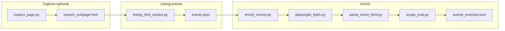

# Conference extractor — architecture and how it works

This folder is a **small pipeline**: capture or reuse HTML → extract a flat list of events → fetch each event’s pages in a browser → parse HTML into a **canonical record** → compute **scope** from rules in `taxonomy.json`.

---

## End-to-end flow



1. **`inspect_page.py`** (optional) — Opens a URL with Playwright, waits through common bot interstitials (see `harvest_all_html.py`), saves `page.html` and optional DOM dumps for debugging selectors.

2. **`listing_html_extract.py`** — Reads **saved listing HTML** only (no browser). Pulls event rows by:
   - `window.open('https://…')` URLs (any host),
   - **Schema.org JSON-LD** (`ItemList` / `Event`),
   - **directory-style** tables/rails (`#listing-events`, `#featured-events`) when present.

   Output: **`events.json`** — array of lightweight objects (must include `event_url` for the next step; other fields vary by source).

3. **`enrich_events.py`** — For each seed row:
   - Fetches **`event_url`** (event detail/about page).
   - Parses with **`parse_event_html.parse_event_detail`** → fills venue, dates, org, crawler URLs (`/exhibitors`, `/sponsors`, `/visitors`), etc.
   - Optionally (`--satellite`) fetches exhibitor + sponsor list pages and merges lists.
   - Optionally (`--speakers`) fetches the speakers tab URL when present.
   - Maps **industry** from text using **`taxonomy.json`** (`map_industry`).
   - Runs **`evaluate_scope`** → fills **`scope`** (B2B, networking, engagement flags, `in_scope`, rule version).
   - Writes **`events_enriched.json`** — array of full **`empty_record()`**-shaped objects.

---

## Main modules

| Module | Role |
|--------|------|
| `conference_record.py` | **`empty_record()`** schema (all datapoint keys + `scope` + `listing_metadata` + `detail_parse_notes`), **`merge_nonempty`**, **`domain_from_url`**. |
| `parse_event_html.py` | **BeautifulSoup** parsers: detail page, exhibitors list, sponsors list, speakers list. Host-agnostic helpers (e.g. same-site vs external links for exhibitor websites). |
| `scope_eval.py` | **`load_taxonomy`**, **`map_industry`**, **`methodology_description`** (truncate/normalize), **`evaluate_scope`** driven by `taxonomy.json`. |
| `playwright_fetch.py` | Async **`fetch_page_html`**: Chromium launch, optional stealth (`harvest_all_html`), bounded wait when Cloudflare-style HTML is detected. |
| `harvest_all_html.py` | Shared UA, stealth hook, string heuristics for challenge/hard-block pages. |
| `taxonomy.json` | Industry substring rules, B2B / networking / penalty phrases, **`in_scope_logic`** (e.g. require B2B + at least one engagement signal). |

---

## Data model (enriched record)

The enriched JSON objects follow **`conference_record.empty_record()`**:

- **Identity & URLs:** `event_name`, `event_url`, `conference_domain`, group fields, `hosting_entity`, crawler URLs for exhibitors / sponsors / visitors.
- **When & where:** `start_date`, `end_date`, `venue_name`, address fields, `city`, `country`, etc.
- **Semantics:** `event_description_methodology`, `industry_raw`, `industry`, `industry_methodology` (`code` + `label`).
- **Roll-ups:** `attending_companies`, `exhibitor_companies`, `exhibitor_company_websites`, `sponsor_*`, `speakers` (list of `{name, ...}`).
- **`scope`:** boolean flags + `in_scope` + `scope_rule_version`.
- **`listing_metadata`:** merged listing seed + parser hints (counts, JSON-LD positions, geo, hub URL, etc.).
- **`detail_parse_notes`:** strings such as fetch errors, `speakers_tab_disabled`, etc.

---

## Scope logic (summary)

`evaluate_scope(record, taxonomy)`:

- **B2B** — text hits positive phrases and avoids “consumer festival” style penalties.
- **Networking** — optional substring hits (see `taxonomy.json`).
- **Engagement** — exhibitors (non-empty list and/or listing count estimate), sponsors (**non-empty `sponsor_companies` only**), speakers (non-empty list).
- **`in_scope`** — configured by `in_scope_logic` (typically: must be B2B; must have at least one of exhibitor/sponsor/speaker signals).

Rules are **versioned** via `scope_rule_version` in `taxonomy.json`.

---

## Extension points

- **New site / different HTML:** Add or adjust selectors in **`parse_event_html.py`** (and, for list pages, **`listing_html_extract.py`**).
- **Stricter or different targeting:** Edit **`taxonomy.json`** or load a copy with **`enrich_events.py --taxonomy`**.
- **Blocking / CAPTCHA:** Run with **`--headed --chrome`**, adjust **`--timeout`**, or **`--proxy`**.

---

## How to run (short)

From this directory, after `pip install -r requirements.txt` and `playwright install chromium`:

```bash
python listing_html_extract.py inspect_out/page.html --out events.json
python enrich_events.py events.json -o events_enriched.json --satellite --speakers
```

See inline docstrings in **`inspect_page.py`** and **`enrich_events.py`** for flags (`--limit`, `--concurrency`, etc.).
